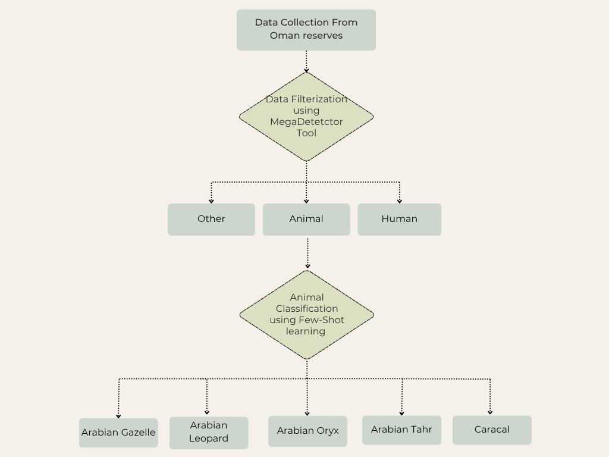
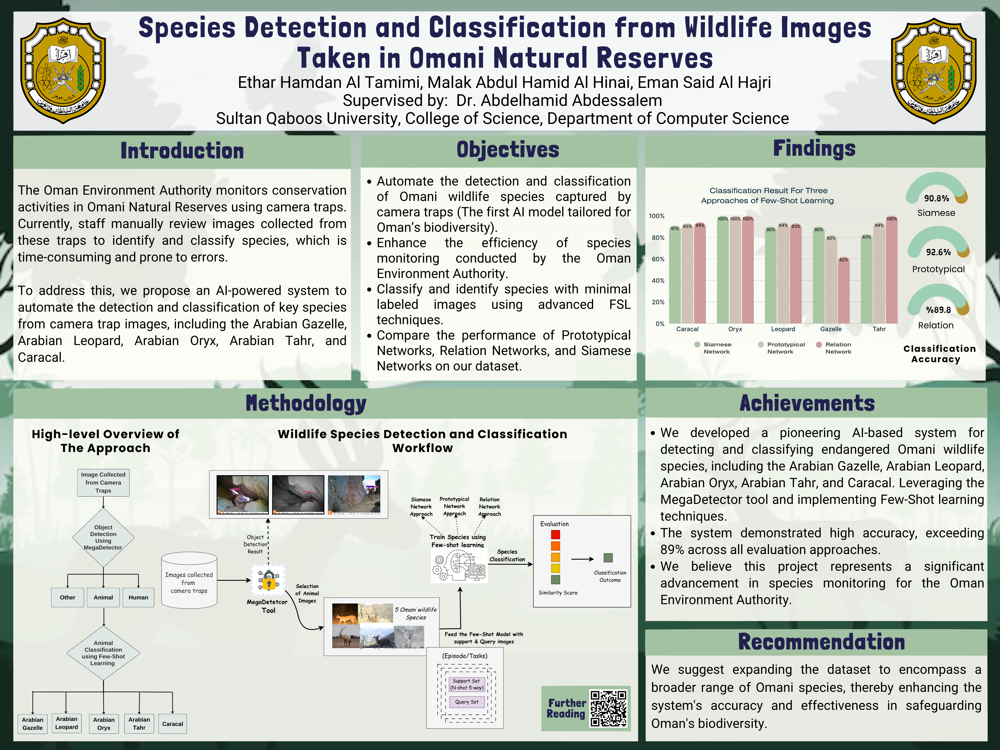
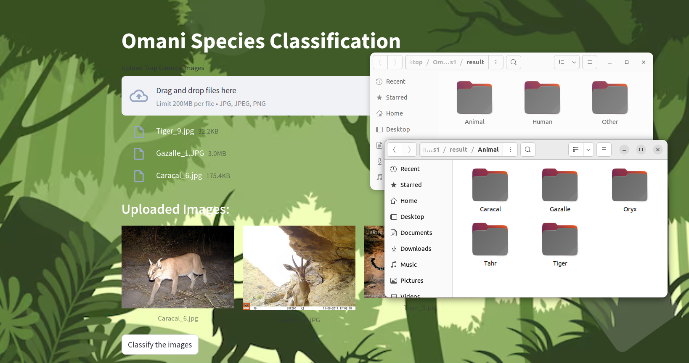

# Oman-Species-Detection-and-Classification
Omani Wildlife Detection and Classification Using Few-Shot Learning

1. Project Overview
- Wildlife cameras capture vast amounts of images, which require manual filtering and sorting. This project aims to enhance the monitoring of wildlife species in Oman reserves by addressing the challenge of Omani wildlife species classification with limited labeled data through implementing few-shot learning techniques.

2. Project Steps

- Approach 1: Siamese Networks
  Compare test images with reference Omani species images using learned similarity metrics
  Calculate average similarity scores across all reference images per Omani species
  Classify based on highest similarity match

- Approach 2: Prototypical Networks
Create prototype representations for each Omani species class
Use ResNet-18 backbone with cosine similarity for classification
Generate embeddings and compare with class prototypes

- Approach 3: Relation Networks
Combine feature extraction (ResNet-50) with relation learning
Use attribute and relation networks to measure similarity between support and query images Classify based on learned relational features

3. Result: 
The MegaDetector demonstrated robust performance, efficiently filtering irrelevant images, while the Prototypical Network achieved the highest classification test accuracy at 92.2%, followed by the Siamese Network at 90.5% and the Relation Network at 89.8%.

4. Simple Model Interface using Streamlit:

